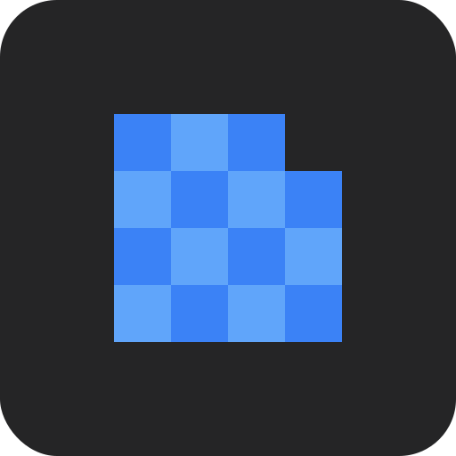
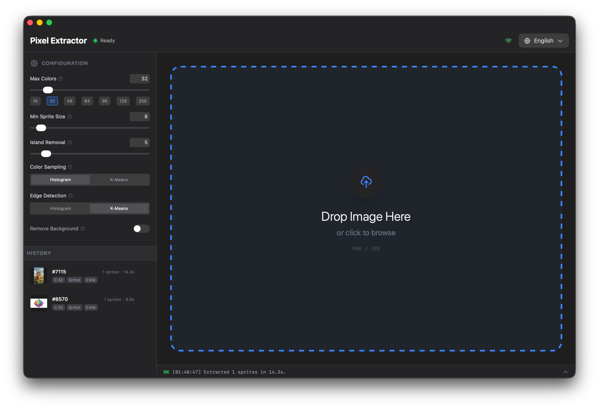
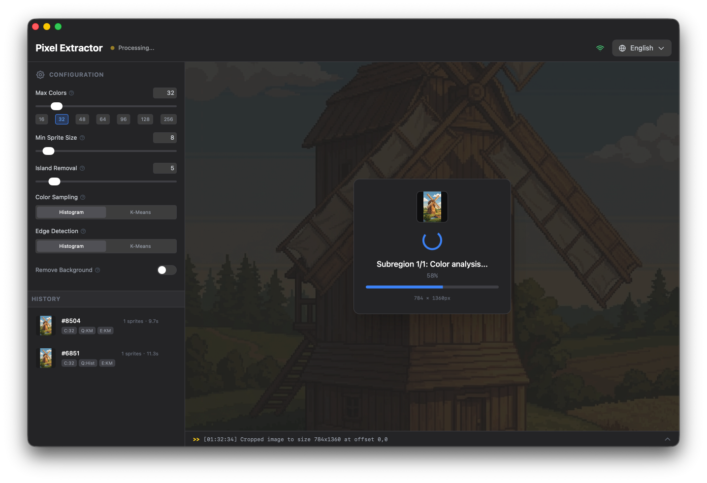
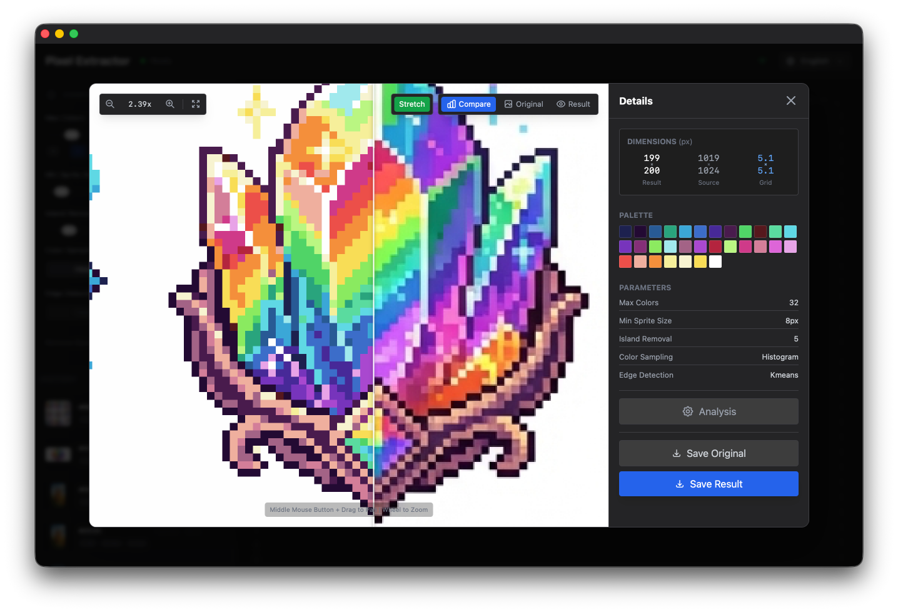
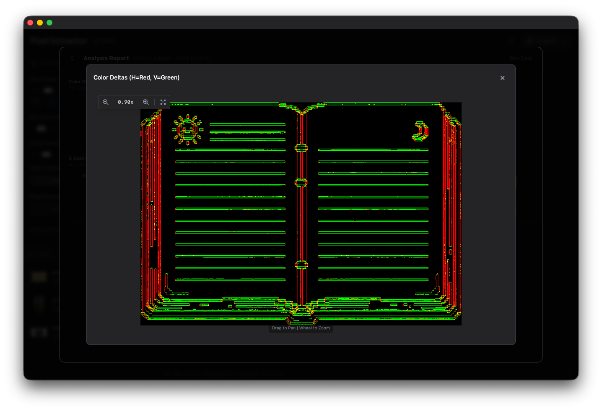
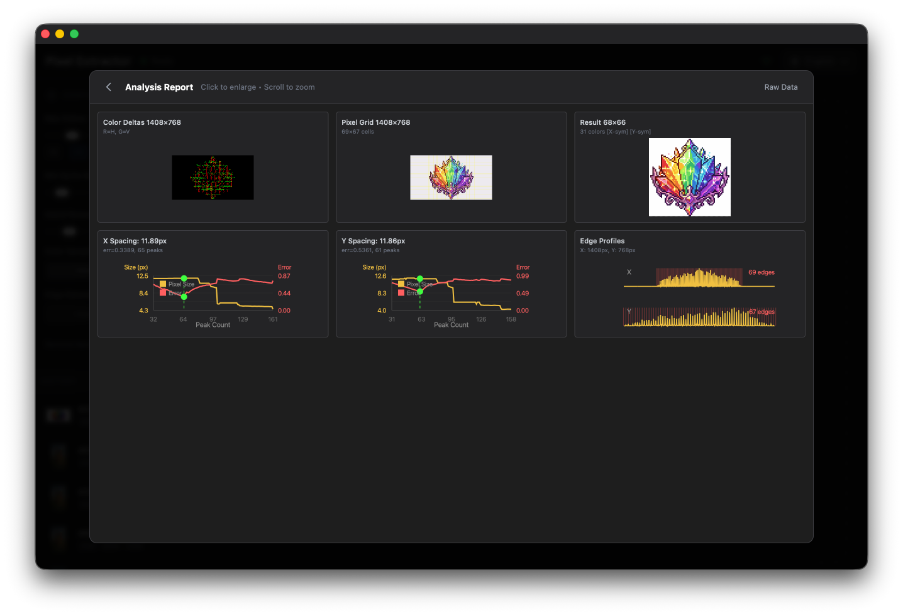
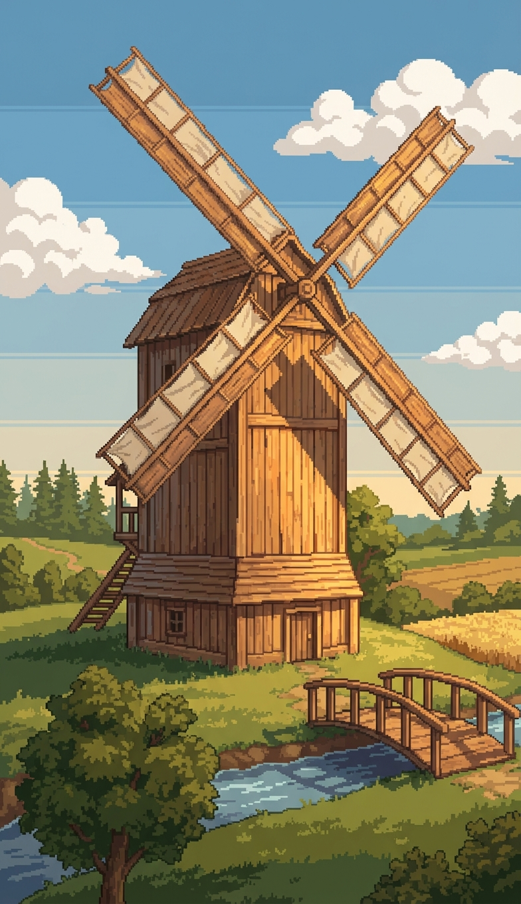
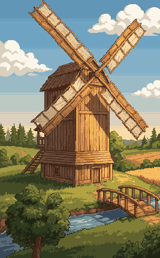
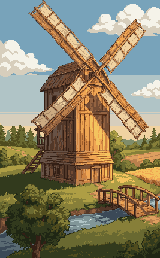

#  Pixel Extractor

**语言：** [English](README.md) | [中文](README.zh.md) | [日本語](README.ja.md)

一个基于 Web 的工具，用于从 AI 生成的或保存不当的像素画（如 JPEG 伪影）中提取干净的像素艺术精灵图，基于 [Donitzo's ai-pixelart-extractor](https://github.com/Donitzo/ai-pixelart-extractor) 构建。

**👉 [在线试用](https://univeous.github.io/Pixel-Extractor/)**

<p align="center">
  
</p>

## 问题描述

AI 生成的像素画通常存在各种伪影，使其无法直接用作游戏素材：

- **颜色渗漏** - 相邻像素之间的杂色渗漏
- **抗锯齿伪影** - 应该是硬像素边界的地方出现了柔和的边缘和渐变
- **网格不一致** - 像素没有对齐到规则网格，或非正方形像素比例
- **噪点背景** - 背景有轻微的颜色变化而不是纯色

大多数现有工具无法很好地处理这些问题：
- 简单缩放（最近邻）只是让问题变小
- 手动工具需要你猜测像素网格大小

## 工作原理

本工具使用**边缘检测**和**网格拟合算法**来智能分析图像并恢复原始像素网格——而不是盲目缩放。

- **自动网格检测** - 无需手动输入像素大小；算法会找到最佳网格
- **非正方形像素支持** - 处理 X 和 Y 像素比例不同的图像（AI 艺术中很常见）
- **自动精灵检测** - 将包含多个精灵的图像拆分为单独的素材
- **智能颜色量化** - Histogram 或 K-Means 方法来清理颜色噪点
- **背景移除** - 自动检测或手动指定背景色
- **前后对比** - 交互式滑块验证提取质量

## 快速开始

### 推荐：安装为 PWA

为了获得最佳体验，**将应用安装为 PWA**（渐进式 Web 应用）：

1. 访问[在线演示](https://univeous.github.io/Pixel-Extractor/)
2. 点击浏览器地址栏中的安装按钮（或使用浏览器菜单 → "安装应用"）
3. 完成！应用现在可以离线工作，感觉就像原生应用

首次加载会下载约 30MB 的 Python 包（NumPy、SciPy 等），这些会被本地缓存。之后，应用加载速度很快——即使离线也能使用。

### UI 提示

- **网络状态指示器**（右上角）：显示在线/离线状态。如果有新版本可用，会显示更新图标——点击刷新并更新。
- **右键历史记录项**：使用当前参数重新处理原始图像或结果图像
- **处理历史**：保存在本地 IndexedDB 中，跨会话持久化（清除浏览器数据会删除历史记录）

<details>
<summary><b>本地运行 / 自托管</b></summary>

<br>

**前置要求：** Node.js 18+

```bash
# 克隆仓库
git clone https://github.com/univeous/Pixel-Extractor.git
cd Pixel-Extractor

# 安装依赖（或使用 yarn/pnpm/bun）
npm install

# 运行开发服务器
npm run dev
```

打开 http://localhost:3000

**构建：**

```bash
npm run build
```

输出将在 `dist/` 文件夹中。

**部署到 GitHub Pages：**

1. Fork 此仓库
2. 转到 Settings → Pages → Source: "GitHub Actions"
3. 推送到 `main` 分支——将自动部署

你的应用将在 `https://<username>.github.io/Pixel-Extractor/` 可用

</details>

## 截图

<p align="center">
  
  
</p>
<p align="center">
  
  
</p>

## 常见问题

<details>
<summary><b>Histogram vs K-Means：如何选择？</b></summary>

<br>

两种方法都不是普遍更好的——它们适合不同的艺术风格。这是一个 **Histogram** 比 K-Means 更好地保留微妙颜色变化的例子：

| 原始 | Histogram | K-Means |
|:--------:|:---------:|:-------:|
|  |  |  |

注意天空区域：原始图像有三种相似但不同的蓝色调。

- **Histogram** 正确保留了颜色，保持了微妙的渐变
- **K-Means** 将它们合并为单一蓝色，失去了大气深度

这是因为 K-Means 优化聚类中心，可能会将感知上不同但数值上接近的颜色分组在一起。基于 Histogram 的量化尊重图像中的实际颜色分布。

**提示**：两种方法都试试，看看哪个更适合你的图像——处理很快！😉

</details>

<details>
<summary><b>为什么使用 Python/WASM 而不是纯 TypeScript？</b></summary>

<br>

核心算法严重依赖科学计算库：

- **NumPy** - 快速数组运算和线性代数
- **SciPy** - 信号处理（峰值检测、优化）
- **scikit-image** - 图像处理（形态学、边缘检测、去噪）
- **scikit-learn** - K-Means 聚类用于颜色量化

用 TypeScript 重新实现所有这些将是：
1. 一项巨大的工作（数千行优化的数值代码）
2. 可能更慢（这些库在底层使用高度优化的 C/Fortran）
3. 难以维护（原始算法是用 Python 编写的）

感谢 [Pyodide](https://pyodide.org/)，我们可以通过 WebAssembly 在浏览器中运行完全相同的 Python 代码。代价是约 30MB 的初始下载（首次加载后缓存），但处理本身相当快。

</details>

<details>
<summary><b>为什么首次加载这么慢？</b></summary>

<br>

首次访问时，应用需要下载：
- Pyodide 运行时（~10MB）
- Python 包：NumPy、SciPy、scikit-image、scikit-learn（总计 ~20MB）

这些由 Service Worker 缓存，因此后续访问（甚至离线）会立即加载。安装为 PWA 以获得最佳体验。

</details>

<details>
<summary><b>我提取的精灵图看起来不对</b></summary>

<br>

这个工具不是魔法修复——AI 生成的像素画通常有根本性问题（主要是网格不一致），没有算法能够完全纠正。

话虽如此，尝试调整这些参数：

- **最大颜色数** - 如果丢失颜色细节则增加，如果噪点太多则减少
- **颜色采样 / 边缘检测** - 尝试在 Histogram 和 K-Means 之间切换
- **孤岛移除** - 增加以移除更多孤立的噪点像素
- **移除背景色** - 如果背景被错误检测，则关闭

将此工具视为为你提供一个**更干净的基座**。输出可能仍需要手动调整，但应该比从原始 AI 输出开始要容易得多。

</details>

## 技术栈

- **前端**：React + TypeScript + Tailwind CSS
- **处理**：Python（NumPy、SciPy、scikit-image、scikit-learn）通过 Pyodide 在 WebAssembly 中运行
- **构建**：Vite

## 致谢

核心提取算法基于 Donitzo 的 [ai-pixelart-extractor](https://github.com/Donitzo/ai-pixelart-extractor)。
